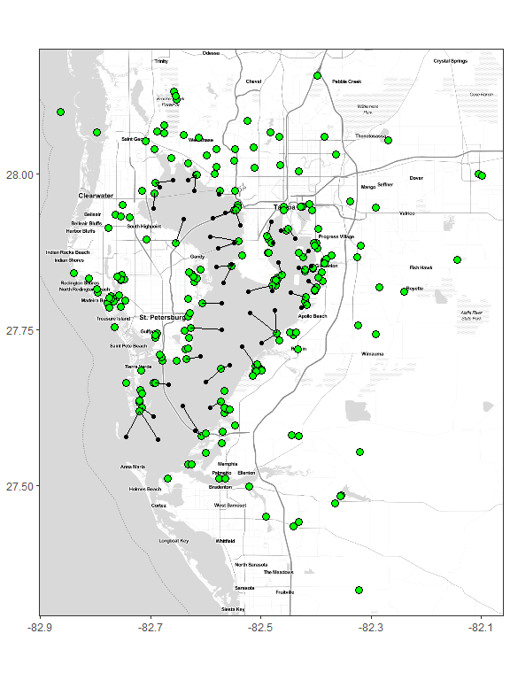
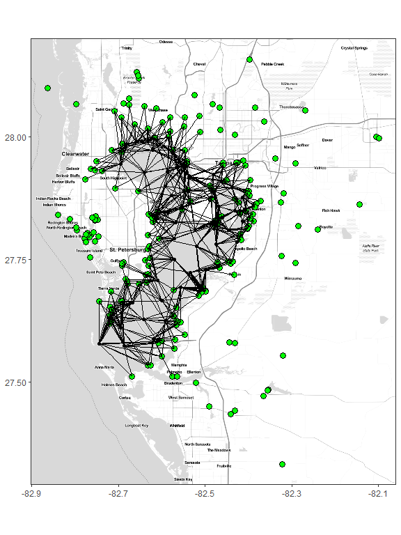

# Exploratory plots of restoration activities in TB


```r
library(tidyverse)
library(readxl)
library(ggmap)
library(lubridate)
library(geosphere)
library(stringi)
library(tibble)
knitr::knit('tbrest.Rmd', tangle = TRUE)
file.copy('tbrest.R', 'R/tbrest.R')
file.remove('tbrest.R')
```

## Restoration data


```r
fl <- 'data-raw/TBEP_Restoration Database_11_21_07_JRH.csv'

# clean up habitat restoration data
habdat <- fl %>% 
  read_csv %>% 
  select(Latitude, Longitude, Project_Completion_Date, `Restoration Category`, `Activity-1`, `Acres-1`) %>% 
  rename(
    lat = Latitude, 
    lon = Longitude, 
    date = Project_Completion_Date, 
    tech = `Restoration Category`, 
    type = `Activity-1`, 
    acre = `Acres-1`
  ) %>% 
  mutate(
    id = stri_rand_strings(nrow(.), length = 4),
    lat = as.numeric(lat),
    lon = as.numeric(lon),
    date = as.numeric(date),
    tech = toupper(tech)
  ) %>% 
  filter(lat > 27.3 & lat < 28.2) %>% 
  filter(!is.na(date))

# habitat restoration station locs
habstat <- habdat %>% 
  select(id, lat, lon) %>% 
  unique

# normalized habitat data
habdat <- habdat %>% 
  select(-lat, -lon)

save(habdat, file = 'data/habdat.RData', compress = 'xz')
save(habstat, file = 'data/habstat.RData', compress = 'xz')
```

Habitat restoration projects:

```r
head(habdat)
```

```
## # A tibble: 6 x 5
##    date                   tech          type  acre    id
##   <dbl>                  <chr>         <chr> <dbl> <chr>
## 1  2005       WETLAND CREATION Establishment  14.0  bF48
## 2  1998       WETLAND CREATION Establishment   3.0  8EX8
## 3  2005 HYDROLOGIC RESTORATION   Enhancement  12.8  govs
## 4  2004         EXOTIC CONTROL   Enhancement 123.9  v5jh
## 5  2006             EXCAVATION Establishment  20.0  lHl6
## 6  2006             EXCAVATION Establishment  26.0  5jmu
```
Locations of habitat restoration projects:

```r
head(habstat)
```

```
## # A tibble: 6 x 3
##      id      lat       lon
##   <chr>    <dbl>     <dbl>
## 1  bF48 27.93133 -82.73820
## 2  8EX8 27.95087 -82.54180
## 3  govs 27.88977 -82.39888
## 4  v5jh 27.88994 -82.40340
## 5  lHl6 27.97370 -82.71504
## 6  5jmu 27.97370 -82.71504
```

## Load data


```r
loads <- read_excel('data-raw/loads.xlsx')

lddat <- loads %>% 
  filter(!`Bay Segment` %in% c(5, 6, 7)) %>% 
  rename(
    seg = `Bay Segment`,
    h2o = `H2O Load (m3/month)`,
    tn = `TN Load (kg/month)`,
    tp = `TP Load (kg/month)`, 
    tss = `TSS Load (kg/month)`,
    bod = `BOD Load (kg/month)`, 
    yr = Year, 
    mo = Month
    ) %>% 
  gather('var', 'val', h2o:bod) %>% 
  mutate(
    val = as.numeric(val),
    seg = factor(seg, levels = c('1', '2', '3', '4'), labels = c('OTB', 'HB', 'MTB', 'LTB'))
    ) %>% 
  group_by(seg, yr, mo, var) %>% 
  summarise(val = sum(val, na.rm = TRUE))

ggplot(lddat, aes(x = yr, y = val, group = yr)) + 
  geom_boxplot() + 
  facet_grid(var~seg, scales = 'free_y') + 
  scale_y_log10('kg or m3 per month')
```

<!-- -->

## WQ data


```r
wqdat_raw <- read_csv('data-raw/epchc_clean_data_07162017.csv')

# rename, select relevant columns, integrate variables across depths
# annual averages by site, variable
wqdat <- wqdat_raw %>% 
  rename(
    yr = YEAR,
    mo = month,
    dttm = SampleTime,
    stat = epchc_station, 
    lat = Latitude, 
    lon = Longitude,
    sallo = Sal_Bottom_ppth, 
    salmd = Sal_Mid_ppth,
    salhi = Sal_Top_ppth, 
    dolo = DO_Bottom_mg_L,
    domd = DO_Mid_mg_L, 
    dohi = DO_Top_mg_L,
    chla = chl_a
  ) %>% 
  select(stat, yr, mo, dttm, lat, lon, sallo, salmd, salhi, dolo, domd, dohi, chla) %>% 
  gather('var', 'val', sallo:chla) %>% 
  mutate(val = as.numeric(val)) %>% 
  spread('var', 'val') %>% 
  rowwise() %>%
  mutate(
    sal = mean(c(sallo, salmd, salhi), na.rm = TRUE),
    do = mean(c(dolo, domd, dohi), na.rm = TRUE)
  ) %>%
  select(-sallo, -salmd, -salhi, -dolo, -domd, -dohi, -dttm) %>% 
  mutate(
    dy = 1
  ) %>% 
  unite('datetime', yr, mo, dy, sep = '-') %>% 
  mutate(
    datetime = as.Date(datetime, format = '%Y-%m-%d')
  )

# get station locations
wqstat <- wqdat %>% 
  select(stat, lon, lat) %>% 
  unique

# remove denormalized rows
wqdat <- wqdat %>% 
  select(-lon, -lat)
  
save(wqstat, file= 'data/wqstat.RData', compress = 'xz')
save(wqdat, file = 'data/wqdat.RData', compress = 'xz')
```

Water quality station lat/lon:

```r
head(wqstat)
```

```
## # A tibble: 6 x 3
##    stat      lon     lat
##   <int>    <dbl>   <dbl>
## 1    47 -82.6202 27.9726
## 2    60 -82.6316 27.9899
## 3    46 -82.6593 27.9904
## 4    64 -82.6833 27.9794
## 5    66 -82.6397 27.9278
## 6    40 -82.5873 27.9291
```

Water quality data:

```r
head(wqdat)
```

```
## # A tibble: 6 x 5
##    stat   datetime  chla   sal    do
##   <int>     <date> <dbl> <dbl> <dbl>
## 1    47 1974-01-01    NA  21.1   7.9
## 2    60 1974-01-01    NA  21.3   8.2
## 3    46 1974-01-01     3  17.4   8.3
## 4    64 1974-01-01     2  19.1   8.2
## 5    66 1974-01-01    NA  21.3   8.1
## 6    40 1974-01-01    NA  22.0   8.4
```

## Distance to restoration sites {.tabset}


```r
# load restoration and wq data 
data(habstat)
data(wqstat)

# get this many closest to each station
mtch <- 20

# match habitat restoration locations with wq stations by closest mtch locations
wqmtch <- wqstat %>% 
  group_by(stat) %>% 
  nest %>% 
  mutate(
    clo = map(data, function(sta){
   
      # get top mtch closest restoration projects to each station
      dists <- distm(rbind(sta, habstat[, -1])) %>%
        .[-1, 1] %>% 
        data.frame(id = habstat$id, dist = ., stringsAsFactors = F) %>% 
        arrange(dist) %>% 
        .[1:mtch, ] %>% 
        select(-dist) %>% 
        data.frame(., rnk = 1:mtch, stringsAsFactors = F)
      
      return(dists)
      
    })
  ) %>% 
  select(-data) %>% 
  unnest

head(wqmtch)
```

```
## # A tibble: 6 x 3
##    stat    id   rnk
##   <int> <chr> <int>
## 1    47  f3gF     1
## 2    47  CLVT     2
## 3    47  SKKd     3
## 4    47  TUZe     4
## 5    47  NB0b     5
## 6    47  VkUx     6
```

### Closest 

```r
## 
# plots

# combine lat/lon for the plot
toplo <- wqmtch %>% 
  left_join(wqstat, by = 'stat') %>% 
  left_join(habstat, by = 'id')

# extent
ext <- make_bbox(habstat$lon, habstat$lat)
map <- get_stamenmap(ext, zoom = 11, maptype = "toner-lite")

# base map
pbase <- ggmap(map) +
  theme_bw() +
  theme(
    axis.title.x = element_blank(),
    axis.title.y = element_blank()
  ) +
  geom_point(data = habstat, aes(x = lon, y = lat), fill  = 'green', size = 3, pch = 21) +
  geom_point(data = wqstat, aes(x = lon, y = lat))

# closest
toplo1 <- filter(toplo, rnk %in% 1)

pbase + 
  geom_segment(data = toplo1, aes(x = lon.x, y = lat.x, xend = lon.y, yend = lat.y))
```

<!-- -->

### Closest five

```r
# closest five
toplo2 <- filter(toplo, rnk %in% c(1:5))

pbase + 
  geom_segment(data = toplo2, aes(x = lon.x, y = lat.x, xend = lon.y, yend = lat.y))
```

<!-- -->

### Closest twenty

```r
# closest twenty
toplo3 <- filter(toplo, rnk %in% c(1:20))

pbase + 
  geom_segment(data = toplo3, aes(x = lon.x, y = lat.x, xend = lon.y, yend = lat.y))
```

<!-- -->

## Summarizing effects of restoration projects


```r
# diff to summarize wq data, in years before/after restoration projects
yrdf <- 5

# get only chl dat
chldat <- wqdat %>% 
  select(-sal, -do)

wqchng <- wqmtch %>% 
  left_join(habdat, by = 'id') %>% 
  select(-acre) %>% 
  mutate(
    date = paste0(date, '-07-01'),
    date = as.Date(date, format = '%Y-%m-%d')
    ) %>% 
  split(.$stat) %>% 
  map(., function(x){
    
    # iterate through the restoration sites closest to each wq station
    bysta <- x %>% 
      group_by(rnk) %>% 
      nest %>% 
      mutate(
        wqchg = map(data, function(dt){
          
          # summarize before/after wq data based on restoration date
          
          # filter wq data by stat, get date bounds
          statdat <- filter(chldat, stat %in% dt$stat)
          orrng <- range(statdat$datetime)
          
          # get date range +/- restoratin proj defined by yrdf
          dtrng <- with(dt, c(date - yrdf * 365, date + yrdf * 365))
          
          ## get values within window in dtrng, only if date available
          bef <- NA; aft <- NA
          
          # before
          if(dtrng[1] >= orrng[1]){
          
            # summarizes values before
            bef <- filter(statdat, datetime >= dtrng[1] & datetime <= dt$date) %>% 
              .$chla %>% 
              mean(na.rm = TRUE)
            
          }
          
          # after
          if(dtrng[2] <= orrng[2]){
            
            # summarize values after
            aft <- filter(statdat, datetime <= dtrng[2] & datetime >= dt$date) %>% 
              .$chla %>% 
              mean(na.rm = TRUE)
            
          }
          
          # combine/return the wq station/restoration station summary
          out <- data.frame(bef = bef, aft = aft)
          return(out)
          
        })
      
      )
    
    # return the complete restoration summary
    bysta <- unnest(bysta)
    return(bysta)

  }) %>% 
  do.call('rbind', .) %>% 
  remove_rownames()

head(wqchng)
```

```
## # A tibble: 6 x 8
##     rnk  stat    id       date                   tech          type
##   <int> <int> <chr>     <date>                  <chr>         <chr>
## 1     1     6  lHGQ 1995-07-01 SUBSTRATE MODIFICATION Establishment
## 2     2     6  PVgz 2005-07-01         OYSTER HABITAT Establishment
## 3     3     6  SRbg 2007-07-01         OYSTER HABITAT Establishment
## 4     4     6  VgMZ 1990-07-01       WETLAND PLANTING Establishment
## 5     5     6  r2OZ 2003-07-01         OYSTER HABITAT Establishment
## 6     6     6  v0L6 2004-07-01       WETLAND PLANTING Establishment
## # ... with 2 more variables: bef <dbl>, aft <dbl>
```

